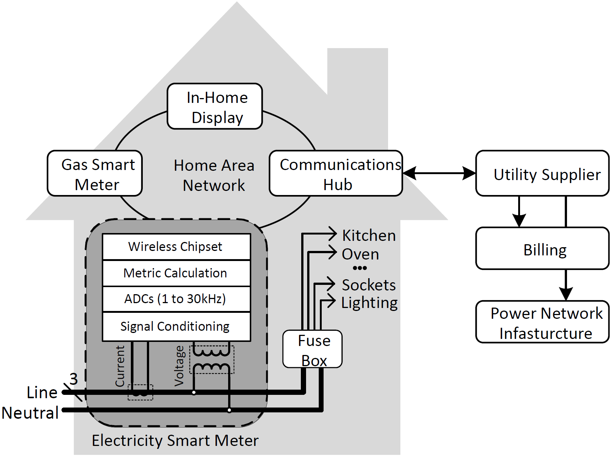
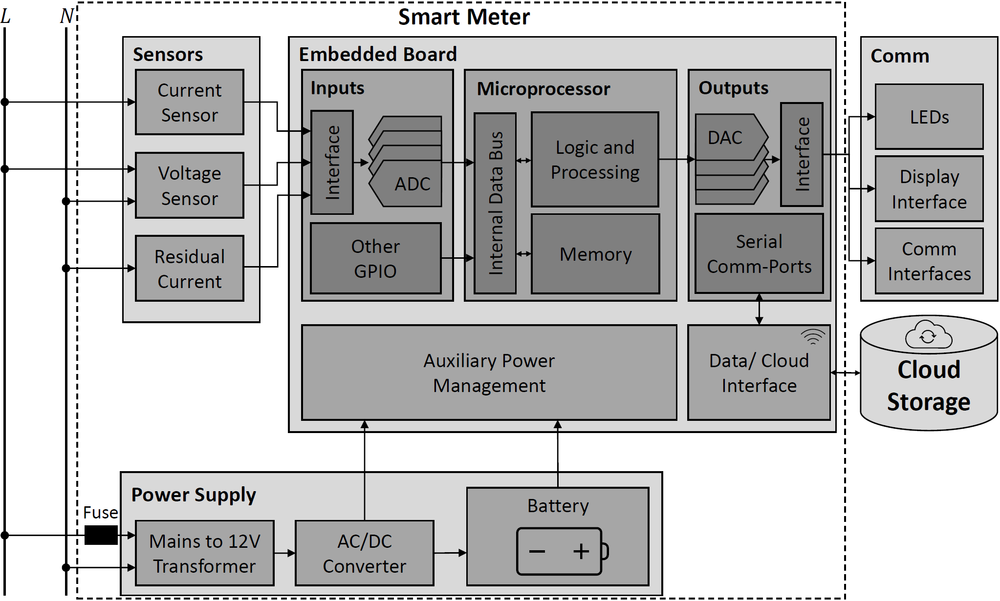
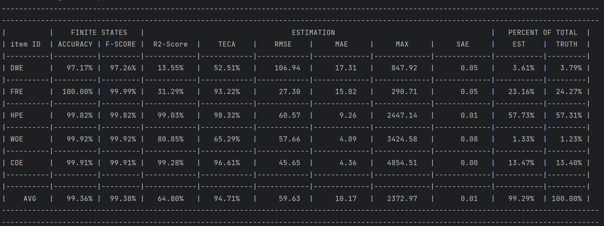
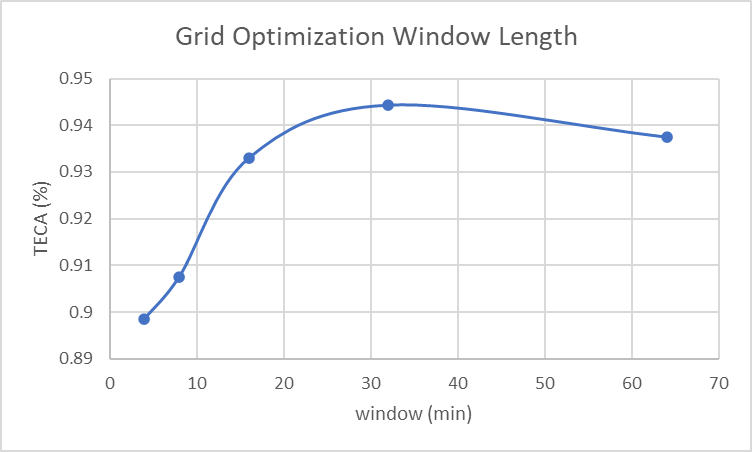

# Introduction
Non-Intrusive Load Monitoring (NILM), also known as energy disaggregation, is a technology used to analyze and identify
the energy consumption of individual appliances within a household or building without the need for dedicated sensors on
each device. Instead, NILM relies on analyzing the overall electrical signal of the entire home or building to disaggregate
and identify the specific energy consumption patterns of different appliances. The process involves using advanced signal processing and machine learning algorithms to distinguish the unique electrical
signatures of various devices. By understanding the power consumption patterns associated with specific appliances, NILM
systems can provide insights into how energy is being used, enabling homeowners and businesses to make informed decisions
about energy efficiency, conservation, and management. This technology plays a crucial role in promoting energy awareness,
optimizing energy usage, and ultimately contributing to more sustainable and cost-effective energy practices. The 
architecture on household-, bus-, and metering-level is illustrated below:

Figure 1: Household level NILM architecture.

Figure 2: Bus level NILM architecture.

Figure 3: Metering level NILM architecture.

BaseNILM is a tool for solving the energy disaggregation problem. It aims to provide a baseline systems for both new and
experienced researchers within the area of energy disaggregation and Non-Intrusive Load Monitoring (NILM). For a full 
description please see the provided documentation under BaseNILM \docu.

# Publication and Citation
The BaseNILM toolkit is part of the following NILM survey paper and tries to replicate the presented architectures and
disaggregation approaches. Please cite the following paper when using the BaseNILM toolkit:

P. A. Schirmer and I. Mporas, "Non-Intrusive Load Monitoring: A Review," in IEEE Transactions on Smart Grid, 
vol. 14, no. 1, pp. 769-784, Jan. 2023, doi: 10.1109/TSG.2022.318959
(https://ieeexplore.ieee.org/document/9820770)

When using the high frequency operating modes please also cite the following papers depending on the approach:

P. A. Schirmer and I. Mporas, "Double Fourier Integral Analysis Based Convolutional Neural Network Regression for
High-Frequency Energy Disaggregation," in IEEE Transactions on Emerging Topics in Computational Intelligence, 
vol. 6, no. 3, pp. 439-449, June 2022, doi: 10.1109/TETCI.2021.3086226
(https://ieeexplore.ieee.org/document/9456987)

P. A. Schirmer and I. Mporas, "2D Transformations of Energy Signals for Energy Disaggregation". Sensors 2022, 22, 7200. 
https://doi.org/10.3390/s2219720

Furthermore, please do also cite the corresponding publicly available datasets. As well as [1] when using the data
balance option, [2] when using the WaveNet pytorch implementations and [3] when using the DSC implementation. For a
complete list of all publicly available datasets please see the NILM survey paper.

# Dependencies
The requirements of the BaseNILM toolkit are summarized in the requirements.txt data file (CPU based). In detail, the 
BaseNILM toolkit was implemented using the following dependencies:
- Python 3.8
- Tensorflow 2.5.0
- Keras 2.4.3
- Scikit-Learn 1.0 
- Numpy 
- Pandas
- Scipy

Additionally, Python 3.11 with tensorflow 2.16 was tested. The requirements.txt file was updated for version 3.11, while
the old requirements have been store using req38.txt. For GPU based calculations CUDA in combination with cuDNN has been
used, utilizing the Nvidia RTX 3000 series for calculation. The following versions have been tested and proven to work
with the BaseNILM toolkit:
- CUDA 11.4
- DNN 8.2.4
- Driver 472.39

# Datasets
The toolkit utilizes the following publicly available datasets, which have been pre-processed and reshaped for the users'
convenience and can be found under /data.

1) REFIT:  https://www.refitsmarthomes.org/datasets/
2) UKDALE: https://jack-kelly.com/data/
3) REDD:   http://redd.csail.mit.edu/
4) AMPds2: https://dataverse.harvard.edu/dataset.xhtml?persistentId=doi:10.7910/DVN/FIE0S4
5) ECO:    https://vs.inf.ethz.ch/res/show.html?what=eco-data
   
If the user wants to utilize their own datasets, data can be either supplied using '.xlsx', '.csv', '.mat', or '.pkl' files. 
Additionally, the '.h5' files converted with nilmtk can be used directly as input for the BaseNILM toolkit, but this option
is not fully supported. To create a new dataset please see the attached templates. For more detailed information on 
possible input data file types please see the readme.txt under \data.

# Limitations and Known Issues
Since the toolkit is still under development there are several things that need to be improved, are not yet implemented 
or lack verification. In the following a list of known issues and limitations is provided:
- Loading data from nilmtk converter '.h5' files has only limited support
- The focus for deep learning models is TensorFlow, while pyTorch is implemented it was not reviewed as extensively
- Source Separation methods are merely implemented for completeness and are not state-of-the-art
- HF data is currently only supported for '.mat' data inputs
- There are minor issues for displaying and formatting units

# Quick Start
For a first test run use start.py to train, test and plot a 10-fold cross validation using the AMPds2 dataset with five
loads (deferrable loads). If you don't want to train simply set 'setupExp['train']==0' as the models for the example
test run are already stored in BaseNILM \mdl. For changing parameters and adapting the parameters please refer to 
the documentation in BaseNILM \docu.

# Architecture
The aim of the PyDTS toolkit is to model the input and output relation of a household energy system, namely $\hat{y}=f(X)$ 
where $X \in \mathbb{R}^{T \times M}$ is a feature input vector (aggregated data) of $T$ time-steps and $M$ features and
$y$ is a time-series output, i.e. appliance consumption values. Mathematically the problem can be formulated as: 
$y(t)=\sum_{m} x_m(t) + \epsilon(t)$, where $\epsilon(t)$ is additional time dependent noise. A more generalized 
architecture is illustrated below:

Figure 4: Implemented generalized NILM architecture.

As can be seen, the general architecture consists of five steps namely pre-processing (e.g. resampling or filtering), window
framing, feature extraction, model prediction, and post-processing (e.g. limiting the output). To better understand the
theory it was also aimed to replicate this architecture in the code whenever possible

## Operating Modes
The toolkit offers three different operating modes. The operating modes can be controlled using 'setupExp['sim']' option
in the start.py file. The following three options are available. First, classical training and testing where a model is
trained using a training and validation dataset, and tested on a testing dataset respectively. Second, hyperparameters
optimization where free model parameters are optimally tuned using scikit GridSearchCV for machine learning models and
keras hyperband tuner for deep learning models utilizing tensorboard. Third, general parameters can be optimized using
a 2D grid search available in 'optiGrid.py'. This grid search performs exhaustive calculation for two independent
parameters specified by the user.

## Models
The toolkit as three different types of models implemented namely models based on Source Separation (SS), e.g. Non-Negative
Matrix Factorization (NMF) or Discriminative Sparse Coding (DSC), models based on Machine/Deep Learning (ML/DL), e.g. 
Support Vector Machine (SVM) or Convolution Neural Networks (CNNs), and models based on Pattern Matching (PM), e.g.
Dynamic Time Warping (DTW) or Minimum Variance Matching (MVM). These three model types also cover the majority of the 
proposed NILM approaches in the literature:

Figure 5: Structure of the different NILM modeling approaches.

# Exemplary Results
In the following chapter, a set of reference results is provided using the “default.txt” setup files provided in \setup. 
For a first test run use start.py to calculate the results presented below, which are already provided as pre-trained
models under \mdl. Therefore, training is disabled in start.py. The problem considered in the default example aims to
predict the power consumption of the AMPDs2 dataset (first year) using the five referable loads.

## Average Results
The average results for different models and different performance metrics are provided in the table below. All results
have been obtained using the default parameters of the toolkit. 

| Output | MAE (W)  | RMSE (W)  | SAE (p.u.) | TECA (%)  |
|--------|----------|-----------|------------|-----------|
| DNN    | 12.63    | 92.33     | 0.06       | 93.43     | 
| CNN    | **9.37** | **59.60** | **0.02**   | **95.13** | 
| LSTM   | 14.46    | 97.91     | 0.03       | 92.48     |

As can be seen in the table above CNN outperforms all other approaches for all performance metrics.

## Detailed Results
The simulation output contains four different plots. The first one provides an analysis of the input features using
violin plots, a heatmap of the input and output features, as well as a feature ranking calculated by RF. The second one
shows the time domain input features. The third one plots the ground truth against the predicted values and evaluates
mean error and error distribution. The fourth one shows the predicted results as well as the error with respect to the
ground truth for both raw values and labels.

Figure 6: Input feature analysis, heatmap, and feature ranking using RF classifier.

Figure 7: Time-domain input features

Figure 8: Scattering results, Gaussian error distribution, and average accuracy values.

Figure 9: Ground-truth and predicted values for power consumption of the WOE device.

Furthermore, the console output for the best performing model (CNN) has been provided below, showing the results on 
device level as well as the average results.

## Optimization Modes
As previously discussed the toolkit comes with two internal optimizer one performing exhaustive grid search over input
variables, e.g. window length or sampling frequency, and the other one optimising hyperparameters, e.g. number of nodes
and layers of a neural network, of tensorflow models. In this section, the results are presented briefly for both
optimizers. The configuration can be found under \setup in the files 'defaultOptiGrid.txt' and 'defaultOptiHyper.txt'.

| Window Length                    | Sampling Time                    |
|----------------------------------|----------------------------------|
|  |  |

Figure 10: Optimal window length and sampling time based on the AMPds2 dataset.

As can be seen the optimal window length was found to be 30 minutes, while a reduction of sampling frequency goes along 
with a continuous reduction in disaggregation performance. Therefore, the CNN has been optimized using 30 minutes as 
window length as well as full sampling resolution of 1 sample/minute. The optimized CNN architecture can be found below.

Figure 11: Optimal CNN configuration based on the AMPds2 dataset.

## State-of-the-Art Comparison
For comparison, we consider the AMPDs2 dataset as it is widely used and the only dataset that provides fully cleaned data,
i.e. no pre-processing is necessary and thus results are exactly comparable. The results for a scenario of
10-fold cross validation using the five most used appliances in the dataset, namely ‘DWE’, 'FRE', 'HPE', ‘WOE’, and
'CDE' are presented. CNN has been used as it was found to work best for the disaggregation task. The detailed setup 
files can be found under \setup\compare and the numerical results are tabulated below.

| Device | TECA   | RMSE (W) | MAE (W) | SAE (p.u.) |
|--------|--------|----------|---------|------------|
| DWE    | 61.67% | 84.60    | 11.55   | 0.27       |
| FRE    | 94.72% | 20.80    | 12.31   | 0.03       |
| HPE    | 97.31% | 53.11    | 7.37    | 0.01       |
| WOE    | 79.86% | 70.40    | 3.60    | 0.13       |
| CDE    | 97.31% | 55.33    | 2.78    | 0.01       |
| Avg    | 94.67% | 56.85    | 7.52    | 0.00       |

For the comparison with the literature the same devices have been considered and different previously published methods
are listed below (* note that these results are only for the first year of AMPds2 and also using current as output 
feature):

| REF      | Year | Model | TECA  | RMSE (W) | MAE (W) |
|----------|------|-------|-------|----------|---------|
| [4]*     | 2016 | HMM   | 94.1% | -        | -       |
| [5]      | 2019 | CNN   | 93.9% | -        | -       |
| [6]      | 2020 | CNN   | 94.7% | -        | -       |
| [7]      | 2021 | CNN   | 95.8% | -        | -       |
| BaseNILM | 2023 | CNN   | 94.7% | 56.85    | 7.52    |
 
# Benchmark
In this section benchmarking results are presented. The aim is to compare different datasets and regression algorithms
using multiple accuracy metrics providing a baseline system for other researchers. In detail, the results have been 
obtained using 10-fold cross validation. The simulation setups can be found under \setup\benchmark and details of the
parameters and models in the documentation und \docu.

## AMPds2

## REDD

# Development
As failure and mistakes are inextricably linked to human nature, the toolkit is obviously not perfect, thus suggestions
and constructive feedback are always welcome. If you want to contribute to the BaseNILM toolkit or spotted any mistake,
please contact me via: p.schirmer@herts.ac.uk

Furthermore, the following improvements are already considered for future versions:
1) Advanced sampling and pre-processing
2) Implementation of GAN models
3) Generation of benchmark results that can be exactly reproduced

# License
The software framework is provided under the MIT license.

# Version History
1) v.0.1: (11.07.2022) Initial version of BaseNILM
2) v.0.2: (19.11.2023) First update of BaseNILM
3) v.1.0: (22.05.2024) Second update of BaseNILM
    - Complete code review including description of functions
    - Update to Python 3.11 including Tensorflow 2.13
    - Adding new deep learning models including: Transformers, Informers, DAEs, and GANs
    - Creating benchmarking report for REDD, REFIT, ECO, UK-DALE and AMPds

# Cite
P. A. Schirmer and I. Mporas, "Non-Intrusive Load Monitoring: A Review," in IEEE Transactions on Smart Grid, 
vol. 14, no. 1, pp. 769-784, Jan. 2023, doi: 10.1109/TSG.2022.318959
(https://ieeexplore.ieee.org/document/9820770)

P. A. Schirmer and I. Mporas, "Double Fourier Integral Analysis Based Convolutional Neural Network Regression for
High-Frequency Energy Disaggregation," in IEEE Transactions on Emerging Topics in Computational Intelligence, 
vol. 6, no. 3, pp. 439-449, June 2022, doi: 10.1109/TETCI.2021.3086226
(https://ieeexplore.ieee.org/document/9456987)

# References
[1] Pan, Yungang, et al. "Sequence-to-subsequence learning with conditional gan for power disaggregation." ICASSP 2020-2020
IEEE International Conference on Acoustics, Speech and Signal Processing (ICASSP). IEEE, 2020.

[2] Jiang, Jie, et al. "Deep Learning-Based Energy Disaggregation and On/Off Detection of Household Appliances." 
ACM Transactions on Knowledge Discovery from Data (TKDD) 15.3 (2021): 1-21.

[3] Batra, Nipun, et al. "Towards reproducible state-of-the-art energy disaggregation." Proceedings of the 6th ACM 
international conference on systems for energy-efficient buildings, cities, and transportation. 2019.

[4] Makonin, Stephen, et al. "Exploiting HMM sparsity to perform online real-time nonintrusive load monitoring." IEEE 
Transactions on smart grid 7.6 (2015): 2575-2585.

[5] Harell, Alon, Stephen Makonin, and Ivan V. Bajić. "Wavenilm: A causal neural network for power disaggregation from 
the complex power signal." ICASSP 2019-2019 IEEE International Conference on Acoustics, Speech and Signal Processing
(ICASSP). IEEE, 2019.

[6] Schirmer, Pascal A., and Iosif Mporas. "Energy disaggregation using fractional calculus." ICASSP 2020-2020 IEEE 
International Conference on Acoustics, Speech and Signal Processing (ICASSP). IEEE, 2020.

[7] Schirmer, Pascal A., and Iosif Mporas. "Low-frequency energy disaggregation based on active and reactive power 
signatures." 2021 29th European Signal Processing Conference (EUSIPCO). IEEE, 2021.
